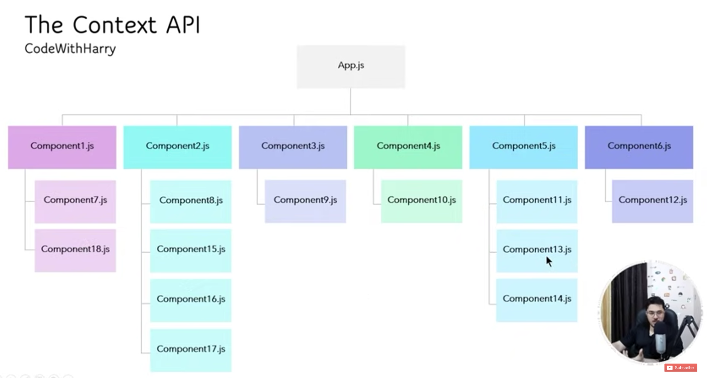

## Here we r gonna connect the Backend with the Frontend & do the changes in frontend ,

* So for the very first,
* Add/open two terminals, one for frontend & other for backend. 

* Add some line of codes in package.json if frontend & backend also..
* Adding the below lines inside script of frontend:

> "server": "nodemon server.js",

>"both": "concurrently \"npm run start\" \"cd backend && npm run server\""  

& this to the backend :

 > "server":"nodemon index.js"

 Now run the code by using the command "npm run both".

 - Now we just add the bootstrap links of JS & CSS in the code for styling purpose.... 
 
## CONTEXT API :
 At its core, the Context API is a mechanism that allows you to share specific information (like state or functions) with multiple components, eliminating the need for prop drilling.

The React Context API is a powerful tool for efficient state management, offering a cleaner alternative to prop drilling and enhancing overall code organization.

 >> HOW TO USE CONTEXTAPI:

 here in the code of iNotebook we have, like very initial step of creating context is :

 1. Creating a context with the help of react using the particular syntax, as mentioned in the noteContext.js directory.For more detailed explanation of this step refer the particular directory.

 2. Now we can leverage the above context in any of the components state,we create state for that so that state can be accessible to everyone very easily, as done in NoteState.js directory,For more detailed explanation of this step refer the particular directory.

>> MAP function in react js

Consider this example & then understand the concept more better , In Sha Allah....

const users = [
  {
    name: "Jesse",
    age: 21,
    height: "1.90cm"
  },
  {
    name: "Tom",
    age: 25,
    height: "1.67cm"
  },
  {
    name: "Anna",
    age: 34,
    height: "1.59cm"
  }
]

const userNames = users.map(({ name }) => name)
// ['Jesse', 'Tom', 'Anna']

As you can see we have an array users. Each user is represented by an object. Each object has 3 properties, those are: name, age and height. The goal here is to get an array of of users’ names and store it as an array.

The simplest way to carry out this operation is by using the map function. We’re calling map on the array users, using the destructuring assignment to reach into each of the user objects and select the name of that particular user. The callback functions returns the name, which gets written into the new array. And just like that we have an array of users’ names ready to use.